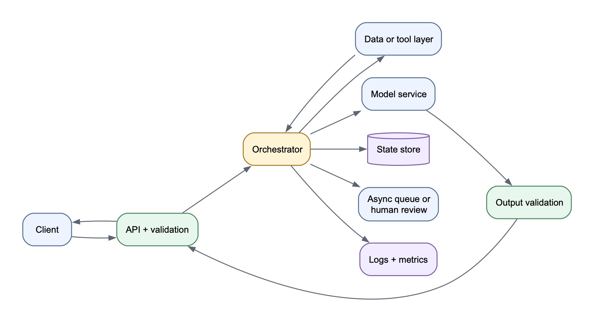

# AI Coding Interview — Final-Hour Cheat Sheet

## The goal of the round

The interviewer is not asking whether an AI tool can produce a patch. They are evaluating whether you can:

1. Convert an ambiguous symptom into a precise engineering contract.
2. Navigate an unfamiliar repository without reading everything.
3. Make and defend an architectural decision.
4. Use AI as an accelerator while keeping ownership visible.
5. Validate the solution with evidence.
6. Communicate limitations and compatibility changes honestly.

## The mental map

> **Frame → Scope → Hypothesize → Trace → Decide → Test → Build → Verify → Defend**

### 1. Frame

State the user-visible symptom and violated invariant.

> “The symptom is ____. The invariant I believe is broken is: every ____ must eventually ____ unless ____.”

Do not start by asking AI to analyze the entire repository.

### 2. Scope

Locate only:

- Contributor instructions.
- Entry point.
- Success path.
- Failure path.
- State owner.
- Existing tests.
- Public types or callbacks that might be affected.

Useful commands:

```bash
rg --files
rg -n "RelevantSymbol|ErrorName|event_name" src tests
git status --short
git diff --stat
git diff
```

### 3. Hypothesize

Say your theory before asking AI:

> “My hypothesis is that ____. I want to verify where ____ is created, where success becomes terminal, and where the exception skips that transition.”

Then ask AI to challenge the hypothesis using files and line numbers.

### 4. Trace

Draw the smallest flow:

```text
Input/event
  → validation
  → dispatch
  → execution
  → state mutation
  → output/protocol completion
  → local notification
```

For every branch ask:

- Success: what marks it complete?
- Ordinary failure: who catches it?
- Timeout: is it a result or an exception?
- Cancellation: must it propagate?
- Retry: could a side effect happen twice?
- Concurrency: can two paths complete the same operation?

### 5. Decide

Present two reasonable options, choose one yourself, and explain:

- Why this layer owns the fix.
- What the caller/model/user sees.
- What local logs and observers see.
- Which existing behavior changes.
- Security implications.
- Retry and idempotency implications.

The smallest patch is not automatically the best patch. The correct patch restores the contract at the component that owns it.

### 6. Test red first

Write or modify one regression test that expresses the missing invariant.

Run it before the source change and confirm:

1. It fails.
2. It fails for the expected reason.
3. It would have caught the original bug.

Then add only the important edges:

- Success regression.
- Ordinary exception.
- Timeout.
- Cancellation.
- Invalid output.
- Sensitive-error sanitization.
- Duplicate or retry behavior where relevant.

### 7. Build

- Make the smallest coherent change.
- Reuse the repository’s established pattern.
- Preserve cancellation semantics.
- Avoid raw exception leakage.
- Avoid public API changes unless required.
- Stop and inspect the diff before broad testing.

### 8. Verify

Use a test pyramid:

1. New regression test.
2. Affected test file.
3. Related subsystem tests.
4. Lint/format checks.
5. Type checking.
6. Final diff and repository status.

Distinguish a code failure from an environment failure. Report exact commands and results.

### 9. Defend

Your two-minute handoff:

> **Root cause:** ____ skipped ____, leaving ____ unresolved.  
> **Design:** I fixed it at ____ because that component owns ____.  
> **Behavior:** Previously ____. Now ____. I deliberately preserved ____.  
> **Evidence:** The regression test failed before the patch and now passes; ____ related tests, lint, and types also pass.  
> **Compatibility:** The externally observable changes are ____.  
> **Limitations:** This does not yet solve ____; production hardening would add ____.

## How to make AI ownership visible

### Good interaction pattern

1. You state the hypothesis.
2. AI gathers targeted evidence.
3. You summarize what the evidence means.
4. AI proposes options without choosing.
5. You choose and explain the trade-off.
6. AI drafts a red test.
7. You inspect the expected failure.
8. AI drafts the smallest patch.
9. You review every changed behavior.
10. AI runs verification; you interpret the result.

### Avoid

- “Analyze the entire repository.”
- “Find the issue, choose the design, implement it, write tests, and summarize it.”
- Accepting an AI claim without locating the code or running the test.
- Running only passing tests after the implementation.
- Reading silently while the interviewer cannot see your reasoning.
- Describing generated code as correct before reviewing its behavior changes.

### Useful prompts

**Investigation**

> “Inspect only the code path relevant to this symptom. Do not edit. Show the success path, failure path, state owner, and existing tests with file and line references.”

**Challenge**

> “My hypothesis is ____. Find evidence that supports or contradicts it. Pay special attention to cancellation, retries, and background tasks.”

**Options**

> “Give me two minimal designs and compare compatibility, failure semantics, security, and tests. Do not choose for me.”

**Red test**

> “Express this invariant in one regression test. Run only that test and stop after showing the expected failure.”

**Implementation**

> “Implement the smallest patch for the design I selected. Reuse existing conventions. Stop and show the diff before broad tests.”

**Review**

> “Review the diff for changed public behavior, duplicate completion, swallowed cancellation, raw exception leakage, non-idempotent retry, and missing tests. Do not edit yet.”

## System-design lens for a coding problem

Even when the patch is small, examine these contracts:

| Contract | Questions |
|---|---|
| Input | What is accepted, validated, and rejected? |
| State | Who owns the operation state and terminal transition? |
| Execution | Sync, async, background task, worker, or external service? |
| Failure | Error result, raised exception, retry, fallback, or cancellation? |
| Concurrency | Can calls race, duplicate, or complete out of order? |
| Compatibility | What did existing callers observe before? |
| Security | Could internal data or raw exceptions escape? |
| Observability | Which events, logs, and metrics reveal success or failure? |

## Lessons from the realtime-tool mock

The bug had three separate contracts:

1. **Execution:** the tool failed or timed out.
2. **Protocol:** the model still needed a terminal result for the original `call_id`.
3. **Application:** local observers needed a failure signal while cancellation retained special meaning.

The root cause was not simply “an exception was unhandled.” It was:

> The failure path informed the local application but skipped the model-visible protocol completion, leaving the call open and freezing the conversation.

Important precision lessons:

- Say “at most one completion in one local invocation,” not distributed “exactly once.”
- Extending a callback discriminator changes the values existing callbacks may receive.
- Converting raised failures into recoverable results changes public exception behavior.
- A terminal event must have clearly defined success-versus-completion semantics.
- Test commands must include every changed and newly added test file.

## If the initial tests all pass

Do not assume there is no bug. Determine whether:

- Existing tests encode the old behavior.
- The failure path has no test.
- The test double does not reproduce the asynchronous or protocol boundary.
- A focused script excludes the relevant new test file.
- The bug appears only after a timeout, callback, retry, or background task.

Write the missing contract as a regression test and show the red state.

## Recovery script when stuck

Say aloud:

> “I don’t need to understand the entire repository. I need the violated invariant, the successful state transition, the point where failure diverges, and the component that owns the missing transition.”

Then answer:

1. What starts the operation?
2. What uniquely identifies it?
3. What marks success as terminal?
4. Where does failure go?
5. What transition is skipped?
6. Who owns that transition?
7. What old behavior might callers depend on?
8. What one test proves the original defect?

## Final five-minute checklist

- [ ] I can state the bug and invariant in one sentence.
- [ ] I showed a targeted trace, not a repository dump.
- [ ] I chose the design and named the rejected alternative.
- [ ] I demonstrated red → green.
- [ ] I preserved or deliberately changed cancellation, timeout, and retry behavior.
- [ ] I reviewed security and compatibility.
- [ ] I ran every changed test file plus relevant checks.
- [ ] I can explain every modified line.
- [ ] I can give the two-minute handoff without AI.

## Three phrases to remember

> **The AI gathers evidence; I make the decision.**

> **First restore the contract, then optimize the implementation.**

> **A passing test is useful only if it could have failed on the original bug.**

---

# Greenfield / Solution-Architecture Variant

When the task is to design and build a new solution rather than fix a bug, use:

> **Clarify → Contract → Flow → State → Policies → Vertical slice → Evaluate → Extend**

The goal is:

> **Design broadly, implement one narrow vertical slice, and clearly separate prototype decisions from production architecture.**

## 1. Clarify the problem

Ask only questions that materially change the design:

- Who is the user?
- What input enters the system?
- What output must be produced?
- Is the workflow synchronous, asynchronous, or streaming?
- What scale should the MVP support?
- Which latency, quality, cost, or availability target matters most?
- What data, models, and tools are available?
- What must never happen?
- How will success be evaluated?

Then state bounded assumptions:

> “For this prototype, I’ll assume one tenant, synchronous requests, a small dataset, and no strict availability requirement. I’ll preserve interfaces that could later support multi-tenancy and asynchronous execution.”

Do not spend fifteen minutes collecting every possible requirement.

## 2. Define the contract

Define the API or primary interface before drawing components.

Example:

```json
POST /answer
{
  "question": "...",
  "session_id": "..."
}
```

```json
{
  "answer": "...",
  "evidence": [],
  "status": "completed"
}
```

State critical invariants:

- Every accepted request reaches a terminal state.
- Side-effecting operations are idempotent.
- Answers requiring evidence cannot finalize without evidence.
- Tenant data cannot cross authorization boundaries.
- Timeouts and partial failures are visible rather than silently ignored.

## 3. Draw the request flow

Start with the simplest happy path:

```text
Client
  → API and validation
  → application orchestrator
  → dependency or model
  → result validator
  → response
```

Add components only when they have a clear responsibility:



[Diagram source](assets/diagrams/ai-coding-greenfield-architecture.mmd)

For each component, explain:

- Its responsibility.
- Its inputs and outputs.
- Whether it owns state.
- What happens when it fails.
- Why it is a separate component.

## 4. Identify state and sources of truth

Ask:

- What is durable?
- What is request-local?
- What is derived and rebuildable?
- What is authoritative?

| Data | Storage | Reason |
|---|---|---|
| Request status | Transactional database | Durable lifecycle and recovery |
| Documents | Object store | Durable source material |
| Embeddings | Vector index | Derived and rebuildable |
| Session context | Session store or client | Multi-turn continuity |
| Audit events | Append-only log | Investigation and compliance |
| Temporary tool results | Request state | Needed only during execution |

A vector database is normally a derived retrieval index, not the source of truth.

## 5. Define policies and failure behavior

Cover:

- Input validation.
- Authentication and authorization.
- Timeouts.
- Retries.
- Idempotency.
- Bounded loops.
- Fallbacks.
- Human escalation.
- Sensitive-data handling.
- Model-output validation.

For sensitive AI actions:

> **The model proposes. Deterministic application code validates permissions and executes the action.**

## 6. Choose one vertical slice to code

Do not implement every architecture box.

Say:

> “I’ll describe the production architecture, but I’ll implement the highest-risk request path through stable interfaces in the remaining time.”

A strong vertical slice includes:

1. Typed request and response.
2. One orchestration function.
3. Interfaces for external dependencies.
4. One real or fake dependency implementation.
5. One important failure path.
6. Two or three focused tests.
7. A runnable demonstration.

Example boundary:

```python
class Retriever(Protocol):
    def search(self, query: str) -> list[Evidence]: ...


class Generator(Protocol):
    def answer(
        self, question: str, evidence: list[Evidence]
    ) -> str: ...


class AnswerService:
    def answer(self, request: AnswerRequest) -> AnswerResponse:
        evidence = self.retriever.search(request.question)

        if not evidence:
            return AnswerResponse(
                status="insufficient_evidence",
                answer=None,
                evidence=[],
            )

        answer = self.generator.answer(request.question, evidence)
        return AnswerResponse(
            status="completed",
            answer=answer,
            evidence=evidence,
        )
```

The amount of code is less important than whether the code reflects the architectural boundaries.

## Greenfield 60-minute allocation

### Minutes 0–5: clarify

- User, input, and output.
- Scale and latency.
- Safety or correctness requirements.
- Available dependencies.

### Minutes 5–12: contracts and requirements

- Functional requirements.
- Two or three non-functional requirements.
- API schema.
- Critical invariants.

### Minutes 12–20: architecture

- Happy-path data flow.
- State and source of truth.
- Failure paths.
- One major alternative and trade-off.

### Minutes 20–42: implement the vertical slice

- Core types.
- Interfaces.
- Orchestration.
- One important failure case.
- Avoid UI and infrastructure boilerplate unless required.

### Minutes 42–52: test and demonstrate

Test:

- Happy path.
- Missing or invalid data.
- Dependency failure or timeout.
- A critical invariant such as idempotency or grounding.

### Minutes 52–60: handoff

- Architecture.
- Implemented slice.
- Reason for choosing it.
- Intentionally mocked components.
- Trade-offs.
- Production roadmap.

## AI prompts for a greenfield task

### Requirements review

> “Given this prompt and my stated assumptions, identify only requirements that materially alter the architecture. Do not design the solution yet.”

### Architecture review

> “Here is my proposed request flow and component ownership. Identify coupling, missing failure states, and unclear sources of truth. Give alternatives but do not choose for me.”

### Scaffold

> “Create minimal interfaces and data types for this architecture. Do not implement external integrations or add frameworks.”

### Test review

> “List the smallest tests that prove the happy path and critical invariants. Prioritize five or fewer.”

### Final review

> “Review the implementation against my stated architecture. Identify mismatches, unhandled failures, and claims unsupported by the code. Do not edit.”

## If the requested system is too large

Say:

> “The complete production system is larger than the interview. I’ll first establish component boundaries and failure semantics, then implement one end-to-end path. I’ll mock external infrastructure behind interfaces so the prototype remains runnable.”

## Greenfield final handoff

> “I designed the system around ____. The request enters through ____, while ____ owns durable state. I separated ____ because ____. For the coding portion, I implemented the highest-risk vertical slice: ____. The tests cover ____. The prototype assumes ____. At production scale, I would next add ____. The main trade-off is ____.”

Remember:

> **Architecture establishes the boundaries; the code proves one boundary works.**
