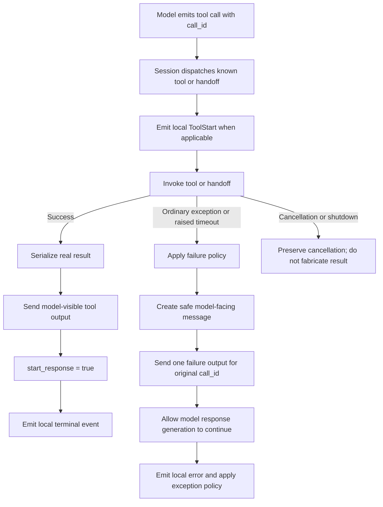

# AI Coding Round 1 Debrief — Realtime Tool Failure Recovery

Date: July 13, 2026  
Format: 60-minute AI-enabled coding interview with stronger emphasis on design  
Project: OpenAI Agents Python SDK `v0.17.1` source snapshot  
Result: **Borderline pass — 75/100**

## Main lesson

The code worked, but an AI-enabled interview evaluates more than whether the AI can produce a working patch:

> Use AI to accelerate investigation and implementation while keeping problem framing, design decisions, compatibility analysis, and final verification visibly yours.

The final artifact was strong. The weaker signal was ownership: the transcript showed the AI doing most of the architectural reasoning, implementation, and test authoring. In a real interview, the interviewer must be able to distinguish the candidate's judgment from the tool's output.

## Round summary

The defect was in the realtime tool-call path. A known function tool or handoff could raise an exception. The local application observed the failure, but the model never received a terminal tool result for the original `call_id`. It therefore waited for an output that would never arrive and the conversation appeared frozen.

The submitted solution:

- Caught function-tool and handoff failures in the realtime session layer.
- Preserved `asyncio.CancelledError` as cancellation.
- Sent one generic, model-visible failure result with `start_response=True`.
- Emitted a local `RealtimeError` and consumed ordinary tool exceptions so the session survived.
- Added formatter categories for function-tool and handoff failures.
- Converted invalid handoff results into recoverable model-visible failures.
- Updated four existing tests and added nine tests.

Verified evidence:

- 85 directly affected tests passed independently.
- The session transcript recorded a broader run of 327 passing tests.
- Ruff, Mypy, and an independent Pyright check passed.
- The unchanged repositories and pristine snapshot were not modified.
- A broader evaluator run encountered only environment limitations involving sandboxed socket binding and an optional FastAPI dependency.

## Scorecard

| Area | Score | Assessment |
|---|---:|---|
| Problem decomposition | 19/25 | Correct diagnosis, but much of it was generated by AI after an overly broad start |
| Implementation | 19/25 | Functional and safe by default, with underexplored compatibility changes |
| Tests and verification | 17/20 | Strong coverage, but no demonstrated red-to-green sequence and some duplication |
| AI-tool usage | 8/15 | Useful progressive investigation, followed by excessive delegation |
| Communication | 12/15 | Strong final explanation, with a few inaccurate technical claims |
| **Total** | **75/100** | **Strong artifact; mixed evidence of candidate ownership** |

## What went well

- Correctly found the boundary between model-visible protocol completion and local error reporting.
- Distinguished default `error_as_result` timeouts from `raise_exception` timeouts.
- Traced the complete path from model tool call to tool execution, outbound tool result, and next model response.
- Correctly chose the realtime session layer rather than modifying the shared tool executor.
- Covered function failures, raised timeouts, handoff failures, invalid handoff results, cancellation, formatter behavior, and success regressions.
- Used safe generic model-facing messages instead of raw exception text.
- Preserved cancellation rather than converting shutdown into an ordinary failure.
- Produced a concise final handoff covering root cause, design, evidence, and limitations.
- Did not inspect the evaluator guide despite discovering its path.

## What went wrong

### The opening prompt was far too broad

The first request asked the AI to analyze approximately 91,000 lines and report every file, function, invocation, and dependency. That consumed roughly 17 minutes of a 60-minute interview even though the interview prompt already identified the realtime tool-call subsystem.

Better opening:

> Read the interview prompt and inspect only the realtime tool-call path. Do not implement. Return the event flow, failure invariant, relevant files, and existing tests.

### The AI produced most of the visible reasoning

The later prompts narrowed the problem effectively, but the AI supplied the root-cause analysis, design options, recommendation, implementation, tests, and final handoff. The transcript contained limited evidence of an independent candidate hypothesis or a candidate-led review of the generated diff.

In an interview, first state a position:

> My hypothesis is that the exception crosses the protocol boundary without closing the model's call. I want to verify where the call is scheduled, where local errors are emitted, and which component owns the outbound result.

Then ask AI to validate or challenge it.

### The implementation was delegated end to end

The prompt effectively said: implement the entire solution and have another agent write tests. Delegation is allowed, but it weakens the evidence that the candidate can make and defend engineering decisions.

A stronger pattern is to divide the work into checkpoints:

1. AI investigates and reports evidence.
2. Candidate chooses and explains the compatibility boundary.
3. AI writes one failing regression test.
4. Candidate reviews the failure.
5. AI implements the smallest approved patch.
6. Candidate reviews the diff and requests targeted corrections.
7. Candidate runs and explains verification.

### There was no demonstrated red-to-green test sequence

The parallel test agent reported that the source fix was already present when it wrote the nine new tests. All tests passed immediately. This proves coverage against the completed implementation, but not that the tests would detect the original defect.

For stronger evidence:

1. Change one existing zero-output assertion to the desired one-output behavior.
2. Run it and show the expected failure.
3. Implement the fix.
4. Run the same test and show it passing.
5. Add remaining edge cases.

### The compatibility discussion was incomplete

Extending a `Literal` is not an append-only positional-compatibility change. No dataclass fields were appended. Instead, existing callbacks can now receive new `kind` discriminator values. A callback that assumes only `approval_rejected` may fail or behave unexpectedly.

The implementation catches formatter failures and falls back to a generic message, which reduces operational risk, but the new callback behavior is still part of the public compatibility analysis.

The solution also changed three existing behaviors:

- Direct timeouts no longer propagate `ToolTimeoutError`.
- Async tool failures no longer populate `_stored_exception`.
- Invalid handoff results no longer propagate `UserError`.

These may be reasonable changes for a resilient realtime session, but they must be called out explicitly rather than described as implementation details.

### The formatter claim was inaccurate

The handoff said raw exception data could be exposed if a formatter opted in. However, `ToolErrorFormatterArgs` did not contain the exception. The formatter could customize a message using the tool name, call ID, kind, and context, but could not directly inspect the actual failure.

The implementation was therefore safer than the description, but less expressive than claimed.

### `RealtimeToolEnd` semantics were not fully defended

The solution emitted `RealtimeToolEnd` for a failed function tool to close the start/end pair. This is defensible if `ToolEnd` means terminal completion. It is questionable if consumers interpret it as successful execution.

The design should explicitly define:

> `RealtimeToolEnd` means that the attempt reached a terminal state; `RealtimeError` distinguishes failure from success.

If that is not the intended event contract, failure should use a distinct terminal event or only the error event.

### “Exactly once” was overstated

The helper emits once within a single `_handle_tool_call` execution. It does not deduplicate duplicate inbound events with the same `call_id`, and it cannot guarantee distributed exactly-once delivery if the network fails after the server accepts an output but before the client observes success.

The correct claim is:

> Success and failure are mutually exclusive within one local invocation, so the handler emits at most one model-visible terminal result on that execution path.

Production hardening would require call-state tracking, idempotent server behavior, and reconciliation for ambiguous sends.

### The test surface was larger than necessary

The new nine-test file duplicated several cases already rewritten in `test_session.py`. Coverage was strong, but a tighter interview patch could have updated the four existing tests and added only the missing handoff, cancellation, and formatter-fallback cases.

### The final pasted command did not include the new tests

`run-focused-tests.sh` ran only the original `test_session.py`, producing 76 passes. The broader 327-test command did include the new tests and was present in the transcript, so verification was valid. Still, the final visible command should have included every changed test file to avoid ambiguity.

## Technical mental map

When debugging an agent or realtime tool failure, separate three contracts:

1. **Execution contract:** Did the tool succeed, fail, time out, or get cancelled?
2. **Protocol contract:** Did the model receive one terminal output associated with its original `call_id`?
3. **Application contract:** Did local observers receive the correct events, logs, state changes, and exception behavior?

For every branch, ask:

- Does the model's call reach a terminal protocol state?
- Does the local application learn what happened?
- Does cancellation retain its special meaning?
- Can sensitive failure details reach the model?
- Is the existing public behavior preserved or deliberately changed?
- Could a retry execute a non-idempotent action twice?

## Reusable AI-coding framework

Use this sequence:

> **Frame. Trace. Decide. Test. Build. Verify. Defend.**

### 1. Frame

Restate the user-visible failure and the invariant being violated.

> Every accepted model tool call must reach one terminal outcome visible to the model, unless the session is cancelled.

### 2. Trace

Find:

- Entry event or API call
- Dispatch point
- Success path
- Failure path
- Background-task callback
- State mutations
- Outbound protocol message
- Relevant tests

Do not analyze the whole repository.

### 3. Decide

Choose and explain:

- Catch layer
- Error propagation versus recovery
- Model-visible error policy
- Local event semantics
- Compatibility boundary
- Cancellation behavior
- Retry and idempotency behavior

### 4. Test

Create one failing regression test before implementation. Confirm it fails for the expected reason, not an environment or import problem.

### 5. Build

Implement the smallest change that satisfies the chosen contract. Avoid new public API surface unless the requirement demands it.

### 6. Verify

Run, in order:

1. The new regression test
2. The directly affected test file
3. Related subsystem tests
4. Lint
5. Type checking
6. A final diff review

### 7. Defend

Be ready to explain:

- Why this layer owns the fix
- What behavior changed
- What behavior stayed unchanged
- Why cancellation is different
- What the model sees versus what local logs see
- What remains unsolved at production scale

## A better 60-minute plan

### Minutes 0–5: establish scope

- Read the prompt and contributor instructions.
- Identify the named subsystem and likely call path.
- State the invariant and two clarification questions.

### Minutes 5–15: trace the failure

- Inspect the dispatcher, invocation helper, outbound result, task callback, and tests.
- Draw the success and failure paths.
- Confirm the exact reason the model freezes.

### Minutes 15–22: make the design decision

- Present two viable options.
- Choose one and state compatibility implications.
- Define model-facing and local-facing error semantics.

### Minutes 22–30: write the regression test

- Update or add one test.
- Run it and demonstrate the red state.

### Minutes 30–45: implement

- Make the smallest runtime change.
- Add the remaining high-value edge cases.

### Minutes 45–53: verify

- Run targeted and subsystem tests.
- Run lint and type checking.
- Inspect the final diff for unnecessary surface area.

### Minutes 53–60: handoff

- Root cause
- Design choice
- Compatibility impact
- Test evidence
- Limitations and production follow-ups

## Strong prompt sequence

### Investigation

> Inspect only the realtime tool-call path relevant to this prompt. Do not edit. Show the success path, exception path, background-task behavior, outbound model event, and existing tests. Cite files and line numbers.

### Candidate hypothesis review

> My hypothesis is that the tool exception is locally observed but leaves the model call unresolved. Challenge this hypothesis and identify missing cases, especially cancellation and handoffs.

### Options

> Give me two minimal designs. For each, compare protocol completion, local exception behavior, compatibility, security, and test changes. Do not choose for me.

### Red test

> Modify one existing regression test to express the chosen contract. Run only that test and stop after confirming it fails for the expected reason.

### Implementation

> Implement the smallest patch consistent with the chosen contract. Do not add public API surface unless required. Stop and show the diff before running broad tests.

### Review

> Review the diff for duplicate model outputs, swallowed cancellation, changed exception semantics, raw error leakage, partial handoff state, and untested ambiguous delivery. Do not edit yet.

### Verification

> Run the new test, affected test files, related subsystem tests, lint, and type checking. Report exact commands and distinguish code failures from environment failures.

## Interview recovery script

When lost in an unfamiliar AI codebase, say:

> I do not need to understand the entire repository. I need to identify the user-visible invariant, trace the successful path, find where the failing path diverges, and locate the component that owns the missing state transition. Then I will express that invariant in a failing test before changing runtime code.

Then ask:

1. What event or request starts the flow?
2. What uniquely identifies the operation?
3. What marks success as terminal?
4. Where does an exception go?
5. Which state transition is skipped?
6. Who owns that transition?
7. What existing behavior must remain compatible?
8. What test proves the original defect?

## Final review checklist

### Design

- [ ] I stated the violated invariant.
- [ ] I traced success, failure, timeout, and cancellation.
- [ ] I explained why the selected layer owns the fix.
- [ ] I identified public behavior changes.
- [ ] I separated model-facing details from protected local diagnostics.

### Implementation

- [ ] One local invocation cannot emit both success and failure outputs.
- [ ] Cancellation is not caught as an ordinary exception.
- [ ] Failure before a handoff state mutation cannot partially swap agents.
- [ ] New public API surface is necessary and justified.
- [ ] Event names and semantics remain coherent for downstream consumers.

### Tests

- [ ] A regression test failed before the fix.
- [ ] The original call ID is asserted.
- [ ] `start_response=True` is asserted.
- [ ] Model output is sanitized.
- [ ] Local error behavior is asserted.
- [ ] Cancellation and success regressions are covered.
- [ ] Every changed or new test file is included in the final command.

### AI ownership

- [ ] I proposed a hypothesis before asking AI.
- [ ] I chose the design instead of asking AI to choose it.
- [ ] I reviewed generated code before accepting it.
- [ ] I challenged at least one AI claim using code or test evidence.
- [ ] I can explain every modified line without the AI transcript.

## Useful mnemonic

> The model call must close. The app must know. Cancellation must remain cancellation.

For AI-tool usage:

> AI investigates and drafts. I frame, decide, verify, and defend.

## Recommended follow-up practice

Repeat this exercise with a fresh defect while imposing these constraints:

1. No whole-repository analysis prompt.
2. State your hypothesis before using AI.
3. Require a failing test before implementation.
4. Do not delegate both source and tests simultaneously.
5. Review the generated diff aloud before allowing corrections.
6. Finish with a compatibility table: old behavior, new behavior, reason, risk.

The technical ability is present. The next goal is making your ownership of the reasoning unmistakable.

