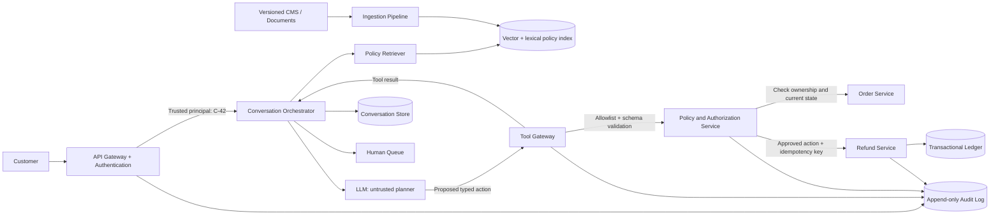

# Mock 1 Debrief - Customer Support Agent

## Main lesson

The central design correction is to separate probabilistic reasoning from deterministic enforcement:

> The LLM proposes an action; trusted application code authorizes and executes it.

Assume the model can hallucinate, ignore its prompt, suffer prompt injection, repeat itself, or emit arbitrary tool arguments. Even under that assumption, the surrounding system must prevent unauthorized access and invalid or duplicate transactions.

## What went well

- Good initial functional and non-functional requirement gathering.
- Correctly identified company knowledge, customer context, tools, bounded iteration, evidence, and human escalation.
- Recognized that the agent needs working state and that unresolved cases must fail safely.
- Explained the flow coherently and admitted uncertainty instead of bluffing.

## What needed correction

### Prompts are behavioral guidance, not enforcement

`SYSTEM.md`, `AGENTS.md`, `TOOLS.md`, and prompt-injection instructions help the model behave correctly, but the model can ignore them. They cannot enforce authorization, financial limits, schemas, or exactly-once actions.

### Regex is not a prompt-injection security boundary

Regex can block a few known strings but cannot reliably recognize paraphrases, encoded content, indirect injection in retrieved documents, or novel attacks. The safe design limits what a compromised model can do.

### Episodic memory does not provide transaction safety

A transcript can be stale, duplicated, lost, or concurrently updated. Preventing two refunds requires a durable idempotency record and a unique constraint or equivalent guarantee at the write path.

### Vector stores are not systems of record

Vector stores are appropriate for approximate retrieval of relatively stable policy knowledge. They are not appropriate as the authoritative store for mutable orders, customer profiles, financial transactions, or audit events.

### Read-only tools cannot satisfy autonomous resolution

The system needs write tools, but access to them must go through deterministic validation, authorization, policy checks, and idempotent transaction handling.

## Correct high-level architecture

1. API gateway and authentication service validate the signed session and derive the trusted principal.
2. A conversation service loads session state and gives the orchestrator a server-side customer ID.
3. A context builder retrieves relevant company policies and fresh customer/order facts.
4. The LLM proposes either a response, clarification question, escalation, or typed tool action.
5. A tool gateway allowlists tool names and validates arguments against schemas.
6. A policy/authorization service combines the trusted principal, fresh system-of-record state, and versioned business rules.
7. Approved writes execute through internal transactional services with an idempotency key.
8. An action ledger and append-only audit stream record the attempt and committed result.
9. Tool results return to the orchestrator for grounded response generation or human escalation.

## Exact refund path

Suppose authenticated customer `C-42` asks to refund order `A-123`.

1. The authentication service validates the signed token and returns principal `C-42`.
2. The orchestrator retains `C-42` in trusted server-side request context. It is not editable by the LLM.
3. The LLM may propose `refund(order_id="A-123", amount=100)`. It does not supply the authoritative customer ID.
4. The tool gateway verifies that `refund` is allowlisted and the arguments satisfy its JSON schema.
5. The policy service calls the order service with `C-42` and `A-123` to verify ownership, order state, payment state, previous refunds, and eligibility.
6. The policy service enforces the deterministic $100 limit and any escalation rules.
7. If permitted, the action service creates a durable action record and idempotency key. A unique constraint prevents another action for the same logical refund.
8. The refund service receives the trusted principal and idempotency key from application code. A retry with the same key returns the original outcome instead of creating another refund.
9. The committed result is stored in the transaction ledger and emitted to an append-only audit stream.
10. The orchestrator receives the result, generates a response grounded in the tool result and policy evidence, and updates conversation state.

If ownership fails, the policy service rejects the action before any other customer's data is returned to the model.

## Storage choices

### Procedural instructions

- Version-controlled prompt/configuration store
- Contains tool descriptions, response policies, and orchestration instructions
- Used for model behavior, not security enforcement

### Conversation or episodic state

- Durable document or relational database for messages, summaries, tool results, and case state
- Redis can cache active sessions with a TTL
- Tenant/customer partition keys and encryption are required

### Policy or semantic knowledge

- CMS/object storage remains the source of truth
- Ingestion pipeline creates chunks, metadata, and embeddings
- Vector and lexical indexes support retrieval
- Every retrieved chunk retains document ID, version, effective date, and access metadata

### Customer and order state

- Remains in the existing transactional account/order/payment/shipping services
- Retrieved just in time through authorized APIs
- May be cached briefly, but not treated as authoritative outside the source service

### Transaction and action records

- Strongly consistent relational database or existing financial ledger
- Unique constraints/idempotency keys
- Explicit states such as `PROPOSED`, `AUTHORIZED`, `COMMITTED`, `DENIED`, and `UNKNOWN`

### Audit events

- Append-only event log such as Kafka, followed by immutable object storage for retention
- Search/index layer may be added for investigations
- Contains request ID, case ID, principal, action, policy version, decision, tool result, timestamps, and model/prompt versions

## Retry model

Do not use “five retries” uniformly.

- Read timeout: retry with exponential backoff and jitter within the latency budget.
- Invalid tool arguments: allow at most one repair attempt, then escalate.
- Authorization/policy denial: never retry unless relevant facts change.
- Write timeout with unknown outcome: query by idempotency key; do not issue a new logical action.
- Repeated/no-progress agent state: terminate and escalate.
- Global limits: wall-clock deadline, maximum tool calls, token budget, and cost budget.

## Conversation termination

The customer should control whether they want more help, but the backend cannot keep sessions alive forever. Use explicit case states:

- `ACTIVE`
- `WAITING_FOR_CUSTOMER`
- `RESOLVED_PENDING_CONFIRMATION`
- `ESCALATED`
- `CLOSED`

Close after customer confirmation or an inactivity policy, with the ability to reopen the case.

## Interview recovery framework

When an interviewer challenges security, transactions, or failures, pause and say:

> I am going to separate model intelligence from trusted enforcement. I will treat the LLM as an untrusted planner that proposes typed actions. Deterministic services will authenticate, authorize, validate, enforce policy, make writes idempotent, and audit the outcome.

Then ask six questions:

1. What is the trusted identity source?
2. What invariants must hold even when the model is wrong?
3. Which service owns the authoritative data?
4. Which operation needs strong consistency or idempotency?
5. What happens if the call succeeds but the response is lost?
6. What information must be preserved for audit and human recovery?

## Useful mnemonic

> LLM proposes. Policy disposes. Service executes. Ledger remembers.

This sentence is enough to reorient the design when an AI system-design question turns into a security or transaction-safety discussion.
