# Mock 2 Coaching - Continuous Model Safety Regression Platform

## Initial interview question

> Your Attention Dilution project is currently a research-oriented experiment for testing long-context safety behavior. Design a continuous model-safety regression platform that can evaluate every newly proposed model and serving configuration, compare the results with an approved baseline, and produce an evidence-backed release decision. Explain the end-to-end workflow, high-level architecture, GPU execution and scheduling, evaluation strategy, reproducibility, isolation, failure recovery, storage, release gates, and major trade-offs.

The interviewer may introduce concrete constraints—such as model sizes up to 400B parameters, heterogeneous precision, limited GPU clusters, thousands of harmful, benign, ambiguous, and policy-boundary prompts, automated judges, and human review—after the candidate clarifies the initial problem.

## Why this felt difficult

The project experience was research-oriented, but the interview question asked for a platform around the experiment. The missing step was translating one experimental run into a repeatable service used by many engineers.

The problem becomes manageable when expressed as:

> Given a versioned model, serving configuration, evaluation suite, and release policy, run a reproducible batch workflow and return a release decision with evidence.

This is mostly a batch-processing and workflow-orchestration system with GPU workers. It does not require inventing a new safety method during the system-design interview.

## What went well

- Asked important scale questions about model size, model type, and available GPUs.
- Recognized heterogeneous precision and serving configurations.
- Identified conversation simulation, automated judges, disagreement routing, and human review.
- Recognized cluster isolation and restricted tool/network access.
- Connected the design to the actual attention-dilution experiment.

## What needed refinement

- Requirements began with implementation details such as weight loading instead of the user's end-to-end workflow.
- Release gates were expressed as unrealistic absolutes rather than measured rates, severity levels, confidence intervals, and regression thresholds.
- Model self-reported confidence was treated as trustworthy; evaluator uncertainty should instead come from calibrated judges and human agreement.
- GPU saturation was described as platform unavailability rather than queued work.
- Dataset, model, prompt, judge, serving-configuration, and policy versioning were missing.
- Job submission, scheduling, checkpointing, aggregation, baseline comparison, reporting, and release approval were missing.

## The start-small method

### Version 1 - One experimental run

1. Load one model on one compatible GPU worker.
2. Run one versioned prompt dataset.
3. Store prompts, outputs, metadata, and metrics.
4. Compare results with an approved baseline.
5. Produce a pass/fail report.

### Version 2 - Make it reliable

1. Split the dataset into durable shards.
2. Checkpoint each completed shard.
3. Retry only failed shards.
4. Store large outputs in object storage and run metadata in a relational database.
5. Record exact model, tokenizer, template, seed, precision, engine, hardware, judge, and policy versions.

### Version 3 - Make it a shared platform

1. Add an API/dashboard for job submission and inspection.
2. Add a workflow orchestrator and priority queue.
3. Add a GPU-aware scheduler.
4. Reuse already loaded model weights across prompt shards.
5. Add automated evaluators, human-review routing, aggregation, release gates, and notifications.

## Correct high-level architecture

```mermaid
flowchart LR
    ENG["Model engineer"] --> API["Evaluation API / Dashboard"]
    API --> META[("Metadata DB")]
    API --> WF["Workflow Orchestrator"]

    REG["Model and Config Registry"] --> WF
    SUITE["Versioned Eval Suite Registry"] --> WF
    POLICY["Versioned Release Policy"] --> WF

    WF --> PLAN["Matrix Planner and Sharder"]
    PLAN --> Q["Priority Job Queue"]
    Q --> SCHED["GPU-aware Scheduler"]

    SCHED --> H100["H100 / H200 Workers"]
    SCHED --> A100["A100 Workers"]
    H100 --> RUN["Isolated Inference Runner"]
    A100 --> RUN

    RUN --> OUT[("Output Artifact Store")]
    RUN --> META
    OUT --> EVAL["Evaluator Pipeline"]

    EVAL --> DET["Deterministic Checks"]
    EVAL --> CLS["Safety Classifiers"]
    EVAL --> JUDGE["Calibrated LLM Judges"]
    DET --> AGG["Metrics Aggregator"]
    CLS --> AGG
    JUDGE --> AGG

    JUDGE -->|"Disagreement / low confidence"| HUMAN["Human Review Queue"]
    HUMAN --> AGG

    AGG --> BASE["Baseline Comparator"]
    BASE --> GATE["Release Gate"]
    GATE --> REPORT["Decision Report and Debug Artifacts"]
    GATE -->|"Pass"| RELEASE["Model Release"]
    GATE -->|"Fail"| BLOCK["Block and Investigate"]
```



## Four-plane decomposition

### 1. Control plane

- Evaluation API and dashboard
- Model/configuration registry
- Evaluation-suite and policy registry
- Relational metadata database
- Durable workflow orchestrator

Its job is to accept work, version inputs, track state, and remain available even when no GPUs are free.

### 2. Execution plane

- Queue and GPU-aware scheduler
- Hardware/resource profiles
- Isolated inference workers
- Model weight cache
- Tensor-parallel execution for large models
- Data-parallel prompt shards when multiple replicas are available
- Object storage for large outputs and traces

Its job is to use expensive GPU capacity efficiently and resume after failures.

### 3. Evaluation plane

- Deterministic checks for exact or structured outcomes
- Safety classifiers for cheap first-pass scoring
- Calibrated LLM judges for semantic/rubric evaluation
- Human review for disagreement, uncertainty, novel failures, and critical cases
- Metrics aggregation with confidence intervals and per-slice breakdowns

Its job is to convert raw generations into trustworthy measurements.

### 4. Release plane

- Baseline comparison
- Versioned release policy
- Capability and safety gates
- Approval/exception workflow
- Reports and diagnostic artifacts

Its job is to convert measurements into an auditable decision.

## Minimal functional requirements

1. Register a model artifact and all inference configuration versions.
2. Register/version evaluation datasets, prompts, judges, and release policies.
3. Submit, prioritize, cancel, and inspect an evaluation job.
4. Expand the model/configuration/suite matrix into independently retryable shards.
5. Schedule shards on compatible GPUs and run isolated inference.
6. Persist raw outputs and intermediate results.
7. Score outputs with deterministic, classifier, LLM-judge, and selected human evaluation.
8. Aggregate results and compare against an approved baseline.
9. Generate an explainable pass/fail decision and investigation report.

## Minimal non-functional requirements

1. Standard decision within six hours; largest models within 24 hours.
2. Reproducible results given the same versions and seed, within documented hardware/kernel nondeterminism.
3. Resume from completed shards after worker failure instead of restarting the model run.
4. Strong isolation, restricted network egress, access control, encryption, and audit logs.
5. High GPU utilization, bounded queue time, and fair scheduling across teams.
6. Durable metadata and artifacts with explicit retention policies.
7. Horizontal scale as model/configuration count and dataset size grow.

## Request-to-decision flow

1. An engineer submits an evaluation manifest containing model ID, revision, tokenizer/template, precision, serving engine, hardware constraints, suites, and release policy.
2. The control plane validates that every referenced artifact exists and estimates GPU memory/resource needs.
3. The planner expands the request into a matrix and divides each configuration into prompt shards.
4. The scheduler chooses compatible workers. Large models use tensor parallelism; prompt shards use data parallelism when capacity permits.
5. A worker loads the model once, then processes many shards to amortize weight-loading cost.
6. Each sample result records the prompt ID, response, latency, token counts, seed, model/config versions, and execution metadata.
7. Cheap deterministic/classifier checks run first. Expensive judge calls run only where needed.
8. Disagreement, uncertainty, critical failures, and novel clusters enter the human-review queue.
9. Aggregation computes unsafe-compliance, false-refusal, capability, latency, judge-agreement, and per-slice metrics with confidence intervals.
10. The comparator measures absolute thresholds and regression against the approved baseline.
11. The release gate passes, blocks, or requests an explicitly audited exception.

## GPU scheduling approach

Do not begin by designing a Kubernetes scheduler from scratch. State the policy first:

- Resource profile: GPU type/count, memory, tensor-parallel degree, expected duration, and model-cache key.
- Compatibility filter: remove workers that cannot run the model/configuration.
- Reuse preference: favor workers already holding the correct model weights.
- Priority: release-blocking jobs ahead of exploratory runs.
- Fair share: prevent one team or 400B model from starving all smaller jobs.
- Backfill: run short/small jobs while waiting for a large contiguous GPU allocation.
- Preemption/checkpointing: preempt only at shard boundaries when possible.

## Example release metrics

- Zero observed critical-severity unsafe completions, followed by human confirmation.
- Unsafe-compliance rate below the versioned policy threshold with an upper confidence bound.
- False-refusal rate below the threshold on ordinary benign and benign-sensitive slices.
- Appropriate behavior rate on ambiguous/policy-boundary prompts.
- Capability regression no worse than an allowed delta from the approved baseline.
- No unexplained output change between reference and optimized serving implementations.
- Evaluator agreement above its calibrated minimum; otherwise require human adjudication.

The exact thresholds are product and policy decisions. The platform stores and enforces their versions.

## Concrete data model

- `ModelVersion`
- `ServingConfigVersion`
- `EvalSuiteVersion`
- `JudgeVersion`
- `ReleasePolicyVersion`
- `EvalRun`
- `EvalShard`
- `SampleResult`
- `JudgeResult`
- `HumanReview`
- `ReleaseDecision`

Large payloads such as generations, logits, attention traces, and tensors belong in object storage. The metadata database stores IDs, versions, locations, status, summaries, and relationships.

## How the resume project maps directly to this platform

- The seven-phase experiment becomes a versioned workflow DAG.
- Persistent CSVs become durable sample/shard artifacts.
- OOM-aware relaunch becomes resource estimation plus retrying only failed shards.
- Paired AdvBench/Alpaca prompts become versioned evaluation suites and slices.
- Held-out testing becomes the golden/calibration set.
- Capability-cost analysis becomes a release gate alongside safety.
- A100-40GB versus A100-80GB handling becomes GPU resource profiles.
- Head-level hooks and path patching become optional diagnostic jobs triggered after a regression, not part of every fast release gate.

The underlying reasoning was already present in the project. The interview only required renaming the experimental mechanisms as platform components.

## Interview recovery script

When the scale feels overwhelming, say:

> I will start with one model, one configuration, one dataset, and one GPU worker. The output is a versioned report. Then I will add sharding for throughput, durable orchestration for failures, a GPU scheduler for shared capacity, calibrated evaluators and human review for quality, and finally a release gate.

Then draw five boxes:

```text
Submit -> Schedule -> Run -> Evaluate -> Decide
```

Only expand one box at a time when the interviewer asks.

## Questions to ask before architecture

Limit initial clarification to six questions:

1. Who submits jobs, and what decision must the system return?
2. What model sizes, configurations, and hardware must be supported?
3. What evaluation datasets and human labels already exist?
4. What volume and completion deadline are required?
5. What metrics and regressions block a release?
6. What isolation, confidentiality, and audit requirements apply?

After receiving those answers, summarize them and start the five-box architecture. Do not keep gathering details indefinitely.
