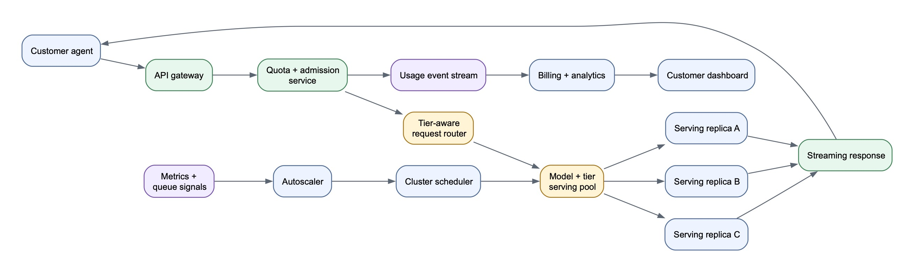
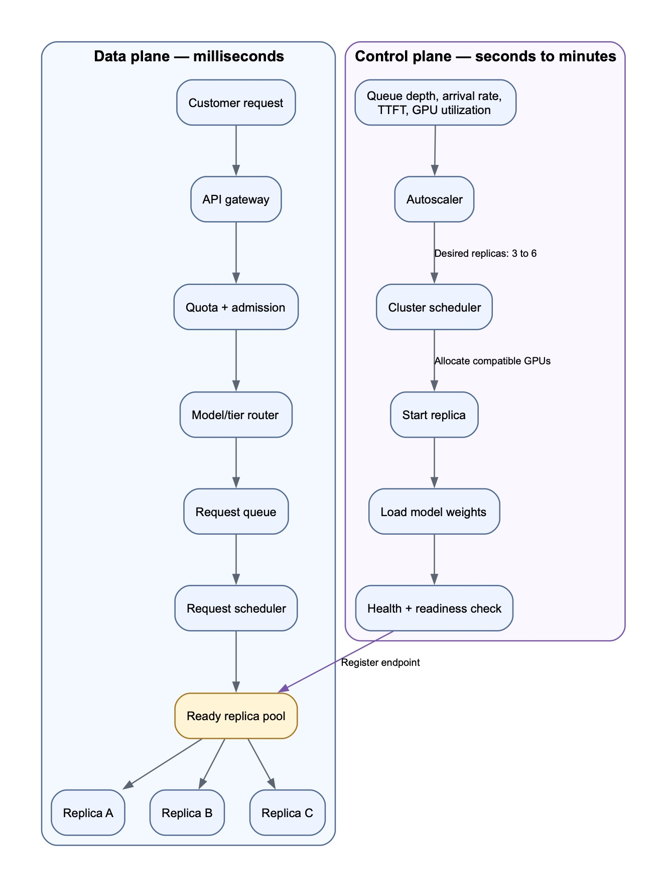
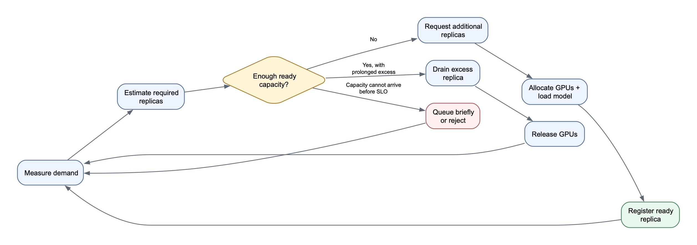

# Mock 3 Coaching — Multi-Tenant LLM Inference Platform

## Initial interview question

> Design an inference platform for customers running bursty, tool-using AI agents. The platform must let customers choose among service tiers that trade off cost, latency, throughput, and admission reliability—for example, shared, priority, fast, and dedicated capacity. Cover the request path, capacity management, GPU scheduling, batching, autoscaling, caching, tenant isolation, overload behavior, observability, and major trade-offs.

The target format is a 45-minute system-design interview. The candidate should clarify requirements, present the simplest viable design, and then revise it as scale and serving constraints are introduced.

## Why this felt difficult

Several terms were unfamiliar at the same time: replicas, serving pools, continuous batching, stateless inference, GPU placement, and autoscaling. This made the problem appear to be one large GPU-scheduling algorithm.

The key simplification is to split it into two timescales:

> Existing model replicas serve requests in milliseconds. A slower control loop adds or removes replicas over seconds or minutes.

You do not need to design a new Kubernetes scheduler or inference engine. In a system-design interview, focus on policies, boundaries, inputs, outputs, and trade-offs.

This mock shifted from interview mode into coaching mode before the design was completed, so it is a learning document rather than a scored final submission.

## Main lesson

Keep three ideas separate:

1. **Request routing:** Which ready replica should receive an admitted request?
2. **Replica placement:** Where should a new model-serving replica run?
3. **Capacity policy:** How many replicas should exist for each model and tier?

A useful summary is:

> Authenticate and admit requests. Route them to ready capacity. Continuously measure demand. Add capacity before sustained demand violates the SLO. Reject work that cannot be served within its deadline.

## Clarified assumptions

### Traffic and bursts

- There is a predictable daily baseline.
- Individual tenants can create sudden correlated bursts at any time.
- Tool-using agents may release thousands of inference calls after a tool or batch step completes.
- Global traffic is approximately 5,000 requests per second normally and can rise to 50,000 requests per second within one minute.

### Model catalog

The platform hosts models; the customer's agent is an application that invokes them.

- Approximately 70% of traffic uses 8B models.
- Approximately 25% uses 70B models.
- Approximately 5% uses models up to 400B parameters.
- Large models may require tensor parallelism across several GPUs or nodes.

### Prompt and response sizes

- Median prompt: approximately 2,000 tokens.
- p95 prompt: approximately 32,000 tokens.
- Median output: approximately 500 tokens.

Token workload matters more than raw request count because two requests can require radically different amounts of computation and KV-cache memory.

### Precision control

- Shared tiers use platform-approved model and precision configurations.
- Customers choose a model/deployment, not an arbitrary precision.
- Dedicated deployments may select among validated BF16/FP16, FP8, or quantized variants.

### API boundary

- Customers call an OpenAI-compatible streaming API.
- The request contains a model/deployment ID, messages, sampling parameters, maximum output tokens, optional tool schemas, and tenant authentication.
- The customer's application owns the agent loop and executes tools.
- The inference platform serves one model inference step at a time; it does not execute arbitrary customer agent programs.

## Service tiers

| Tier | Capacity model | Main optimization | Overload behavior |
|---|---|---|---|
| Shared | Multi-tenant shared replicas | Lowest cost and high GPU utilization | Queue for up to five seconds or return `429` |
| Priority | Shared fleet with preferential admission | Stronger admission and queue-time reliability | Preferential capacity, then bounded rejection |
| Fast | Warm, latency-optimized capacity | Low TTFT and high output-token rate | Reject quickly rather than build a latency-breaking queue |
| Dedicated | Customer-reserved replicas/GPUs | Predictability and isolation | Admit within purchased capacity; apply contracted spillover or rejection |

Example SLO assumptions:

| Tier | Admission and latency expectation |
|---|---|
| Shared | Best effort; queue for at most five seconds or return `429` |
| Priority | 99.9% admitted within one second; p95 TTFT under one second |
| Fast | 99.9% admitted within 250 ms; p95 TTFT under 300 ms |
| Dedicated | 99.95% admission while traffic remains within purchased capacity |

Definitions:

- **Per-request throughput:** generated output tokens per second for an active request.
- **Fleet throughput:** aggregate input and output tokens processed per second.
- **Admission reliability:** probability that a valid request begins service within its tier's queue deadline rather than being rejected, dropped, or timing out.
- **Cost:** shared tiers are typically priced per input/output token; dedicated capacity is primarily priced by reserved GPU time.

Cost itself is a product constraint. The corresponding system quality is high GPU utilization and bounded cost per processed token without violating tier SLOs.

## Corrected functional requirements

1. Authenticate tenants and load their cached entitlements.
2. Accept streaming inference requests and support client cancellation.
3. Validate the model, parameters, tool schemas, context length, and maximum output size.
4. Enforce request-rate, concurrency, and token-budget quotas.
5. Admit, queue, or reject requests according to model capacity and tier policy.
6. Route admitted requests to a compatible model/tier serving pool.
7. Schedule queued requests fairly across tiers and tenants.
8. Execute requests on continuously batched model-serving replicas.
9. Stream tokens and terminal status back to the caller.
10. Meter input tokens, output tokens, latency, and attributable GPU usage for billing and quotas.
11. Autoscale model/tier replica pools within GPU and budget limits.
12. Expose usage, latency, admission, and error analytics without putting the dashboard in the request path.

## Corrected non-functional requirements

1. Meet the tier-specific admission, TTFT, output-token, and availability SLOs.
2. Preserve tenant isolation for authentication, quotas, data, caches, logs, and dedicated capacity.
3. Maintain high GPU and continuous-batch utilization without violating latency targets.
4. Bound queues and fail quickly when a request cannot meet its deadline.
5. Remain correct across replica failure, retry, cancellation, and autoscaling events.
6. Scale horizontally across models, regions, GPU types, and serving pools.
7. Produce auditable billing and quota records.
8. Protect higher-guarantee capacity from lower-tier overload.

## What went well

- Correctly identified authentication, subscription lookup, tier-aware routing, admission control, priority queues, metering, quota enforcement, and customer analytics.
- Recognized that finite capacity requires accept, queue, or reject decisions.
- Correctly moved quota enforcement from the dashboard into a request-path service.
- Asked for clarification instead of pretending to understand unfamiliar serving terms.
- After clarification, correctly described the path from API gateway through quota/admission, routing, serving pool, and replica.

## What needed correction

### Shared traffic does not use a customer-dedicated workload

Shared, priority, and fast traffic routes to a compatible model-and-tier pool. Only dedicated deployments use customer-reserved replicas.

### Request routing and GPU placement are different schedulers

The request router must make decisions in milliseconds. Loading a large model can take 90 seconds or several minutes. Therefore the request path cannot ask the cluster scheduler to find GPUs for each request.

- The **request scheduler** selects queued inference requests and ready replicas.
- The **cluster scheduler** allocates GPUs to long-lived model-serving replicas.

### Replicas belong to deployments, not sessions

A replica processes many tenants and requests concurrently. GPUs are not temporarily reassigned to a higher-priority session. Capacity is changed by creating or removing replicas.

### Conversation history remains customer-owned

Correctness cannot depend on a replica retaining session history. The customer's agent resends the messages required for the next inference step. A session ID may improve cache affinity, but a cache miss must affect only performance.

### The dashboard must not enforce quotas

Quota enforcement is synchronous request-path logic. The dashboard is a presentation layer that reads asynchronously aggregated usage data.

### Pure highest-priority scheduling can starve other tenants

Priority should be combined with per-tenant fairness, reserved tier capacity, concurrency limits, or weighted fair queuing. One priority tenant must not consume the entire shared fleet indefinitely.

## High-level architecture



[Diagram source](assets/diagrams/mock-3-inference-high-level.mmd)

## Request path

1. The customer agent sends a streaming inference request.
2. The API gateway authenticates the tenant, applies request-size limits, and assigns a request ID.
3. The quota/admission service checks cached entitlements, rate limits, concurrent requests, token budgets, and tier policy.
4. The router selects a queue based on region, model, validated serving configuration, and tier.
5. The request scheduler selects work using tier policy plus per-tenant fairness.
6. The router chooses a healthy replica with available KV-cache/batch capacity.
7. The replica performs prompt prefill, joins the request to continuous decoding batches, and streams output tokens.
8. Cancellation or disconnect removes the sequence and releases its KV-cache allocation.
9. The platform reconciles reserved tokens with actual input/output usage and emits durable billing events.
10. The dashboard reads asynchronously aggregated usage and SLO data.

The request path must use cached authentication/entitlement data and highly available quota counters. It should not synchronously query a primary subscription database for every token request.

## Quota and billing flow

Quota enforcement is a platform service:

1. Authenticate the tenant.
2. Load cached subscription entitlements.
3. Check request-rate, concurrent-request, and token-budget limits.
4. Reserve the request's maximum expected token usage.
5. Admit or reject the request atomically.
6. Reconcile the reservation against actual input/output tokens when the request terminates.
7. Emit a durable usage record for billing and analytics.

The hot-path quota service may use distributed token buckets or atomic counters. The durable billing pipeline consumes usage events and produces an auditable ledger. The dashboard is allowed to lag; enforcement is not.

## Stateless inference API

“Stateless” means that every request contains the logical information required to produce the response. Any compatible replica can process it.

The customer's first request may contain:

```json
{
  "model": "model-70b",
  "messages": [
    {"role": "system", "content": "You are a travel assistant."},
    {"role": "user", "content": "Find flights to Boston."}
  ],
  "tools": ["search_flights"]
}
```

If the model requests a tool, the customer executes it and sends another inference request containing the necessary history:

```json
{
  "model": "model-70b",
  "messages": [
    {"role": "system", "content": "You are a travel assistant."},
    {"role": "user", "content": "Find flights to Boston."},
    {"role": "assistant", "tool_call": "search_flights"},
    {"role": "tool", "content": "Three flights found..."}
  ]
}
```

The customer owns context truncation, summarization, and durable agent state. The platform may use an opaque session or prefix identifier to improve cache locality, but the request must remain correct after a cache miss or replica restart.

## What is a replica?

A replica is one running copy of a model-serving deployment. It includes:

- Model weights loaded into GPU memory
- One or more serving-engine processes
- GPU memory reserved for KV caches and temporary activations
- A network endpoint
- Health/readiness state
- A specific model, tokenizer, precision, engine, and batching configuration

A replica can process many concurrent requests. It is not created for one user or one conversation.

### Tensor-parallel sharding versus multiple replicas

Example:

```text
Pool: 70B model, FP8, fast tier

Replica A
└── One complete logical model partitioned across GPUs 1–4

Replica B
└── Another complete logical copy partitioned across GPUs 5–8

Replica C
└── Another complete logical copy partitioned across GPUs 9–12
```

Within Replica A, four GPUs cooperate to execute one logical model using tensor parallelism. Replica B is an independent copy on another four GPUs. A request goes to A, B, or C; it is not divided across all three replicas.

- **Sharding inside a replica:** multiple GPUs cooperate to hold and execute one model copy.
- **Multiple replicas:** independent model copies provide horizontal capacity and fault tolerance.

An 8B replica may use one GPU. A 70B replica may use four GPUs. A 400B replica may use many GPUs across multiple nodes. Each is still one logical serving replica.

## Continuous batching

LLMs generate responses token by token, and requests finish at different times.

Static batching holds a fixed group of requests together. Continuous batching updates the active batch during generation:

```text
Decode step 1: [A, B, C]
Decode step 2: [A, B, C]
C finishes
Decode step 3: [A, B, D]
A finishes
Decode step 4: [E, B, D]
```

When one request finishes, another queued sequence can use the freed batch/KV-cache slot. This increases GPU utilization and fleet throughput.

Trade-off:

- Larger batches improve throughput and cost efficiency.
- Smaller batches and reserved headroom improve per-request latency.
- Shared and fast tiers can therefore use different batching policies even for the same underlying model.

## Data plane and control plane



[Diagram source](assets/diagrams/mock-3-data-control-planes.mmd)

### Data plane

The data plane handles individual requests quickly:

- Authenticate
- Enforce quota
- Admit, queue, or reject
- Select a ready replica
- Batch and execute inference
- Stream tokens
- Meter usage

### Control plane

The control plane changes available capacity:

- Observe demand and SLO metrics
- Calculate desired replica counts
- Allocate compatible GPUs
- Load model weights
- Perform health/readiness checks
- Register or remove replica endpoints

The control plane does not send prompt data to the model. It changes the number and location of ready model servers.

## Autoscaling mental model

Autoscaling is a feedback-control loop:

> Measure demand → estimate required capacity → add or remove replicas → verify the outcome.

You do not need to design Kubernetes internals. Explain the policy.

### 1. Choose a demand unit

Requests per second is insufficient because prompt and response sizes vary. Track:

- Input tokens awaiting prefill
- Incoming token-work per second
- Active decode sequences
- Estimated remaining output tokens
- Queued token work
- Request concurrency

A first-pass design can use normalized token-work per second. A mature scheduler models prefill and decode separately because they stress the GPU differently.

### 2. Benchmark per-replica capacity

For every model, precision, engine, hardware profile, and tier policy, measure the maximum throughput that still meets the SLO.

Example:

```text
70B FP8 fast-tier replica
- Four H100 GPUs
- Benchmark capacity: 20,000 normalized tokens/second
- Target utilization: 70%
- Safe capacity: 14,000 normalized tokens/second
```

Fast tiers use lower utilization and more headroom. Shared tiers use higher utilization and larger batches.

### 3. Estimate desired replicas

An interview-level formula is:

```text
Required work rate
    = incoming work per second
    + queued work / desired queue-drain time

Desired replicas
    = ceil(required work rate / safe capacity per replica)
```

Example:

```text
Incoming work:             40,000 tokens/second
Queued work:               28,000 tokens
Desired backlog drain:          2 seconds
Safe capacity per replica: 14,000 tokens/second

Required rate = 40,000 + 28,000 / 2
              = 54,000 tokens/second

Desired replicas = ceil(54,000 / 14,000)
                 = 4 replicas
```

If three replicas are ready, the autoscaler requests one more. This is an estimate; the important reasoning is connecting measured demand to benchmarked safe capacity.

### 4. Scale-up signals

Evaluate demand periodically using several signals:

- Token arrival rate
- Queue depth and queued token work
- Oldest request age
- TTFT
- Active sequence count
- Continuous-batch occupancy
- KV-cache memory occupancy
- GPU utilization
- Rejection and timeout rates
- Ready, warming, and pending replica counts

Count warming and pending replicas when deciding whether to request more. Otherwise every control-loop iteration may launch duplicate capacity while the first replicas are still loading.

Scale up when predicted work exceeds safe capacity or queue age/TTFT approaches the tier SLO.

### 5. Scale-down policy

Scale down conservatively:

1. Require low utilization for several consecutive minutes.
2. Preserve the tier's minimum warm capacity.
3. Select a replica and stop routing new work to it.
4. Allow active streams to finish or reach a bounded drain deadline.
5. Unregister the replica.
6. Unload the model and release its GPUs.

Use separate scale-up and scale-down thresholds plus cooldown periods. This hysteresis prevents rapid oscillation and repeated expensive weight loading.

### 6. Cold starts

Reactive autoscaling cannot absorb an instantaneous burst if a replica takes 90 seconds or several minutes to load.

Use a combination of:

- Minimum warm replicas
- Reserved burst headroom
- Predictive scaling from daily patterns
- Preloaded model weights on warm workers
- Bounded queues
- Admission control and load shedding
- Dedicated customer reservations

Autoscaling handles sustained demand. Warm capacity and admission control handle the first seconds of an unpredictable burst.

### 7. Reject versus queue

Estimate whether a request can start before its tier deadline:

```text
Predicted wait ≈ queued work / available processing capacity
```

If predicted wait exceeds the tier's maximum:

- Shared requests receive a bounded queue or `429`.
- Priority requests use reserved or preferential capacity, then reject if the SLO is impossible.
- Fast requests reject quickly rather than sitting in a latency-breaking queue.
- Dedicated requests remain within purchased capacity unless the contract allows spillover.

Accepting a request that will inevitably time out is worse than rejecting it early.

## Autoscaling control-loop diagram



[Diagram source](assets/diagrams/mock-3-autoscaling-loop.mmd)

## Example tier-specific autoscaling policies

### Fast tier

- Maintain a nonzero minimum of warm replicas.
- Target approximately 60–70% safe utilization.
- Preserve 30–40% headroom for bursts.
- Use smaller continuous batches.
- Scale on forecasted token load, queue age, and TTFT.
- Reject quickly if the queue would violate latency.
- Scale down only after sustained low utilization.

### Shared tier

- Maintain less warm capacity.
- Target approximately 80–90% utilization.
- Use larger batches for cost efficiency.
- Permit a longer bounded queue.
- Scale toward sustained rather than momentary demand.
- Shed load before consuming fast or dedicated reservations.
- Scale rarely used models to zero when allowed.

### Dedicated tier

- Begin with the customer's purchased minimum capacity.
- Optionally autoscale within a contracted minimum and maximum.
- Never allow shared traffic to consume reserved GPUs unless explicitly permitted.
- Enforce capacity and spillover rules independently per deployment.

## Caching mental model

Caching is an optimization, not an authority or correctness requirement.

### Model weight cache

- Stores model weights on local NVMe or nearby object storage.
- Reduces replica cold-start time.
- The cluster scheduler prefers nodes already caching the required model revision.

### Prefix/KV cache

- Reuses computation for repeated prompt prefixes or continuing sessions.
- Session/prefix affinity may route follow-up calls to a replica with a warm cache.
- Cache entries consume GPU memory and require eviction policies.
- Cache loss must affect only latency and cost; the customer-supplied context preserves correctness.

### Response cache

- Appropriate only when request determinism, privacy, sampling parameters, model revision, and tenant policy allow reuse.
- Cache keys must include every output-affecting input and tenant boundary.
- Often less useful for stochastic agent traffic than prefix caching.

## Isolation mental model

Isolation exists at several levels:

- Authentication and authorization by tenant
- Per-tenant quotas and concurrency limits
- Fair scheduling within a tier
- Cache keys partitioned by tenant or explicitly safe sharing policy
- Sensitive prompts and outputs excluded or redacted from logs
- Dedicated GPUs unavailable to shared traffic
- Regional/data-residency placement constraints
- Per-tenant metrics without cross-tenant data leakage

Shared batching may place sequences from different tenants on the same replica, but application data must remain logically isolated and never appear in another response or metric view.

## Failure and overload behavior

### Replica failure

- Mark the replica unhealthy and remove it from routing.
- Fail or retry only requests whose safety/idempotency policy permits it.
- Do not retry after partially streaming output unless the API defines resumability.
- Autoscaler replaces lost capacity.

### Client cancellation

- Stop future decoding work.
- Remove the sequence from the active batch.
- Release KV-cache memory.
- Record actual billable usage up to cancellation.

### GPU shortage

- Keep control-plane requests pending.
- Protect dedicated and guaranteed-tier reservations.
- Backfill smaller compatible replicas when large contiguous allocations are unavailable.
- Queue within SLO limits and then reject excess load.

### Regional overload

- Route to another region only if latency, data residency, model availability, and customer policy permit it.
- Otherwise load shed predictably rather than allowing unbounded queues.

## Observability

Track by model, tier, region, replica, and tenant where appropriate:

- Request rate and token arrival rate
- Admission, queue, rejection, and timeout rates
- Queue age and queued token work
- TTFT and end-to-end latency
- Output tokens per second
- Prefill and decode throughput
- Active sequences and batch occupancy
- KV-cache utilization and eviction
- GPU compute and memory utilization
- Ready, warming, pending, draining, and unhealthy replicas
- Cold-start and weight-loading time
- Cost per input/output token
- Per-tenant quota and billing reconciliation errors

High-cardinality tenant metrics may need aggregation or sampled diagnostics to control observability cost.

## Interview autoscaling answer template

> I will treat autoscaling as a feedback-control problem. First, I will benchmark safe capacity per model replica under the tier's latency SLO. I will measure token arrival rate, queued token work, queue age, TTFT, batch occupancy, and ready versus warming replicas. The autoscaler converts that demand into a desired replica count. The cluster scheduler places additional replicas on compatible GPUs. Because model cold starts are slow, I will combine reactive scaling with minimum warm capacity, traffic forecasting, and admission control. Scale-up will be aggressive; scale-down will require sustained low utilization and graceful draining.

## Interview recovery framework

When unfamiliar infrastructure terminology appears, pause and ask:

1. What is the unit of deployment?
2. What is the unit of request scheduling?
3. What resource is finite?
4. How long does adding capacity take?
5. What metric represents demand?
6. What is the capacity of one serving unit under the SLO?
7. What happens while new capacity is starting?
8. When should the system reject rather than wait?

Then separate the system into:

```text
Data plane:    authenticate → admit → queue → route → batch → infer → stream → meter
Control plane: observe → estimate → place → load → verify → register → drain
```

## Useful mnemonics

> Requests go to replicas. Replicas go to GPUs.

> Data plane serves now. Control plane prepares what can serve next.

> Autoscaling handles sustained load. Warm capacity and admission control handle immediate bursts.

> Cache improves speed. Customer-supplied context preserves correctness.

## Suggested next practice

Practice explaining the design again without reading the document:

1. Define a replica in one sentence.
2. Explain tensor-parallel sharding versus multiple replicas.
3. Trace one inference request from gateway to streamed response.
4. Explain why the inference API is stateless.
5. Explain continuous batching with three requests of different lengths.
6. Draw the data-plane/control-plane split.
7. Propose a fast-tier autoscaling policy.
8. Explain how the system behaves when all GPUs are occupied and a 10× burst arrives.

The goal is not to memorize every component. The goal is to internalize the two-loop mental model and reconstruct the details from first principles.
