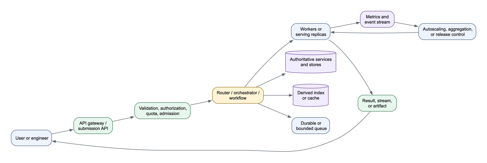
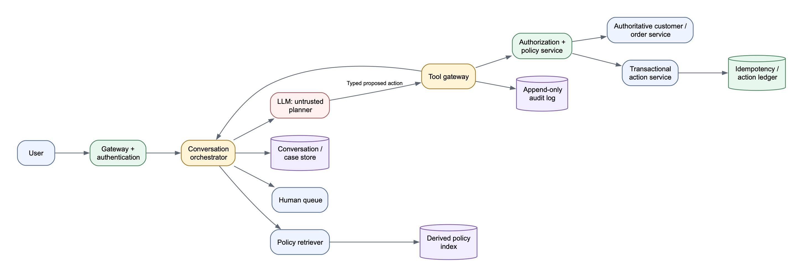

# System Design Round — Final Two-Hour Preparation

## What the interviewer is evaluating

The recruiter named four signals:

1. System architecture understanding.
2. Problem decomposition.
3. Trade-off reasoning.
4. Scalability and performance thinking.

The strongest answer is not the one with the most components. It is the one that:

- Clarifies the product contract.
- Starts with a simple end-to-end path.
- Identifies the finite resource and critical invariant.
- Separates authoritative state from derived data.
- Deep-dives into the hardest component.
- Handles overload and failure explicitly.
- Uses metrics to connect requirements to design decisions.

## Use the next two hours

### Minutes 0–25: learn the common framework

- Rehearse the opening script.
- Practice the 45-minute allocation.
- Draw the common architecture skeleton once.

### Minutes 25–55: revise the three patterns

- Trusted agent and side effects.
- Batch evaluation platform.
- Multi-tenant inference platform.

### Minutes 55–75: calculations and failure scenarios

- Request/token capacity.
- Replica calculation.
- Queue versus reject.
- Retry and idempotency.

### Minutes 75–105: one final 30-minute mock

Take a fresh question and practice requirements, architecture, one deep dive, failures, and summary.

### Minutes 105–115: review weak areas

- Prompt rules versus enforcement.
- Data plane versus control plane.
- Request scheduler versus cluster scheduler.
- Reproducible batch execution.

### Minutes 115–120: stop

Hydrate, reset, and enter the interview with a blank page.

---

# The Reusable Mental Map

For almost every question, reason through:

> **Contract → Flow → State → Capacity → Trust → Failure → Measurement**

## 1. Contract

- Who is the user?
- What action begins the workflow?
- What output or decision completes it?
- Is it synchronous, asynchronous, streaming, or batch?
- What is explicitly out of scope?

## 2. Flow

- What is the simplest successful end-to-end path?
- What is the unit of work: request, case, sequence, shard, or deployment?
- Which components are on the hot path?
- Which work can happen asynchronously?

## 3. State

- What is authoritative?
- What is derived and rebuildable?
- What is request-local, session-level, or durable?
- What requires strong consistency?
- What needs versioning or audit history?

## 4. Capacity

- What resource is finite: GPUs, database writes, worker slots, human review, or tool rate limits?
- What represents demand?
- What is the safe capacity of one serving unit?
- Do we queue, reject, degrade, or scale?

## 5. Trust

- Where does identity come from?
- What can probabilistic models propose?
- What must deterministic code enforce?
- How are tenants and sensitive data isolated?

## 6. Failure

- What happens on timeout, retry, partial success, cancellation, duplicate delivery, and stale state?
- Can a side effect execute twice?
- Can work resume without restarting everything?
- When do we escalate or load shed?

## 7. Measurement

- What defines correctness, safety, latency, throughput, cost, and availability?
- Which metrics trigger scaling or release decisions?
- What evidence supports the trade-off?

## Common architecture skeleton



[Diagram source](assets/diagrams/system-design-common-skeleton.mmd)

Do not force every problem into this exact diagram. Use it as a checklist for missing responsibilities.

---

# Opening the Interview

## First 60 seconds

> “I’ll first clarify the primary workflow, scale, and most important correctness or latency requirement. Then I’ll define a simple end-to-end design, identify the authoritative state and finite resource, and deepen the design around scaling, failure handling, and trade-offs. I’ll state assumptions as we go.”

## High-value clarification categories

Ask four to six questions, not fifteen.

### Product and scope

- Who is the primary user and what outcome ends the workflow?
- Which actions or features are in scope for the first version?
- Is this single-turn, multi-turn, synchronous, asynchronous, or streaming?

### Scale and traffic

- What is average and peak request rate or batch volume?
- Are bursts predictable?
- What are typical and maximum request sizes?
- How many tenants, models, or concurrent jobs exist?

### SLOs

- What latency matters: first response, completion, or batch turnaround?
- What availability and durability are required?
- Is cost or latency the primary optimization target?

### Data and trust

- Where is authoritative data stored?
- Is the system multi-tenant or handling sensitive data?
- Can the system make writes or financial actions?
- What requires human approval?

### Flexibility

- Are models/configurations fixed or customer-selected?
- Can policies and release thresholds change over time?
- May I assume existing authentication, billing, or cluster infrastructure?

## If the interviewer leaves constraints open

State assumptions and continue:

> “I’ll assume 1,000 peak requests per second, multi-tenant traffic, streaming responses, and a p95 time-to-first-token target of two seconds. I’ll keep the design parameterized so we can revise those assumptions.”

The specific numbers matter less than making capacity reasoning possible.

---

# Requirements Template

## Functional requirements

Write four to six user-visible capabilities:

1. Accept or submit the unit of work.
2. Validate and route it.
3. Execute the core workflow.
4. Persist or stream the result.
5. Recover, retry, cancel, or escalate.
6. Expose status, evidence, or usage.

## Non-functional requirements

Select the four most important:

- Latency or batch turnaround.
- Availability and durability.
- Throughput and scalability.
- Consistency and idempotency.
- Security and tenant isolation.
- Reproducibility and auditability.
- Cost efficiency.

Avoid “always available” and “zero harmful outputs.” Use measurable SLOs, bounded risk, severity levels, and confidence intervals.

## Back-of-the-envelope estimates

Only calculate numbers that influence the design.

### Peak request rate

```text
average RPS = daily requests / 86,400
peak RPS    = average RPS × peak factor
```

### Token work

```text
token demand/sec ≈ RPS × expected tokens/request
```

For mature inference designs, separate input/prefill work from active decode sequences because they stress GPUs differently.

### Replica count

```text
required work rate
    = incoming work/sec + queued work / desired drain time

desired replicas
    = ceil(required work rate / safe capacity per replica)
```

Safe capacity must be benchmarked under the target latency SLO, not taken from theoretical GPU peak.

### Storage

```text
daily storage = events/day × average event size
retained storage = daily storage × retention days × replication factor
```

---

# The 45-Minute Structure

## Minutes 0–5: clarify and scope

- Primary workflow.
- Scale and SLO.
- Data/trust boundary.
- Explicit assumptions.

## Minutes 5–9: requirements

- Four to six functional requirements.
- Three to four non-functional requirements.
- One or two explicit non-goals.

## Minutes 9–12: estimate

- Peak work rate.
- One capacity or storage calculation.
- Identify the finite resource.

## Minutes 12–19: high-level architecture

- Draw the happy path first.
- Identify the source of truth.
- Separate synchronous and asynchronous paths.
- Explain each component’s responsibility.

## Minutes 19–31: deep dive

Choose the component that most determines correctness or scale:

- Agent action authorization and idempotency.
- GPU workflow scheduling and reproducibility.
- Continuous batching, routing, or autoscaling.

Do not spend equal time on every box.

## Minutes 31–38: failure and overload

- Dependency timeout.
- Worker/replica failure.
- Partial or ambiguous write.
- Capacity exhaustion.
- Cancellation.
- Regional or control-plane failure where relevant.

## Minutes 38–43: observability and trade-offs

- SLO metrics.
- Cost metrics.
- Quality or safety metrics.
- Chosen versus rejected alternative.

## Minutes 43–45: summarize

> “The design uses ____ for the request path, ____ as the authoritative state, and ____ to manage finite capacity. The key trade-off is ____. It remains safe under ____ because ____. If scale or requirements changed, the first component I would revisit is ____.”

---

# Pattern 1 — Agent That Can Take Actions

Use this pattern for customer support, research assistants with tools, autonomous workflows, and transactional agents.

## Central principle

> **The LLM proposes. Deterministic policy authorizes. Trusted services execute. The ledger remembers.**

## Architecture



[Diagram source](assets/diagrams/system-design-agent-pattern.mmd)

## Trust boundaries

- Identity comes from authenticated server context, never model arguments.
- The model cannot authorize its own action.
- Tool names are allowlisted and arguments schema-validated.
- Fresh ownership and policy checks occur before data disclosure or writes.
- Side effects use durable idempotency keys and transactional records.
- Prompts and regexes are defense-in-depth, not the security boundary.

## Storage

- Policies: CMS/object store is authoritative; vector/lexical index is derived.
- Customer/order data: transactional domain services remain authoritative.
- Conversation: durable case store; cache active sessions if useful.
- Actions: strongly consistent ledger with unique constraints.
- Audit: append-only event stream and immutable retention.

## Failure answer

- Read timeout: bounded retry with backoff/jitter.
- Invalid tool arguments: one repair attempt, then escalate.
- Policy denial: do not retry unless facts change.
- Unknown write outcome: query by idempotency key; never create a new logical action.
- Repeated no-progress loop: wall-clock/tool/token limit, then human escalation.

## Main trade-off

More autonomous actions improve resolution rate but increase the need for deterministic authorization, smaller tool scopes, idempotency, and human review.

---

# Pattern 2 — Continuous Evaluation Platform

Use this pattern for safety regression, model benchmarking, offline experimentation, and release qualification.

## Reframe

> Given a versioned model, serving configuration, evaluation suite, judge set, and release policy, run a reproducible batch workflow and return an auditable release decision.

This is a batch orchestration problem with expensive GPU workers.

## Four planes

### Control plane

- Submission API/dashboard.
- Model, configuration, dataset, judge, and policy registries.
- Relational metadata database.
- Durable workflow orchestrator.

### Execution plane

- Matrix planner and independently retryable shards.
- Priority/fair-share queue.
- GPU-aware scheduler.
- Isolated workers and model-weight cache.
- Object storage for outputs and traces.

### Evaluation plane

- Deterministic checks.
- Safety classifiers.
- Calibrated LLM judges.
- Human review for disagreement, critical cases, and novelty.
- Aggregation with per-slice metrics and confidence intervals.

### Release plane

- Baseline comparison.
- Versioned thresholds.
- Pass/block/exception workflow.
- Evidence-backed report.

## Unit of work

The durable unit is an evaluation shard, not one GPU process or the entire run.

```text
EvalRun
  └─ model × config × suite matrix
       └─ independently retryable prompt shards
```

Checkpoint completed shards so worker loss does not restart the full evaluation.

## GPU scheduling policy

- Filter by GPU type/count/memory and tensor-parallel compatibility.
- Prefer workers with the required model already loaded.
- Prioritize release-blocking work.
- Use fair share so one team or large model cannot starve others.
- Backfill small jobs while waiting for large contiguous allocations.
- Preempt at shard boundaries where possible.

## Reproducibility record

Version:

- Model weights and revision.
- Tokenizer and chat template.
- Precision and serving engine.
- Dataset and prompt template.
- Random seed.
- Hardware and kernel/software versions.
- Judge and release policy.

## Release metrics

- Critical unsafe completions.
- Unsafe-compliance rate and upper confidence bound.
- False-refusal rate on benign slices.
- Appropriate behavior on ambiguous/boundary cases.
- Capability regression against baseline.
- Judge agreement and human-adjudication rate.
- Serving output parity where applicable.

Do not trust model self-reported confidence. Estimate uncertainty through calibrated evaluators, agreement, and human review.

---

# Pattern 3 — Multi-Tenant LLM Inference Platform

Use this pattern for online GPU serving, service tiers, burst handling, quotas, and token billing.

## Central principles

> **Requests go to ready replicas. Replicas go to GPUs.**

> **The data plane serves now. The control plane prepares what can serve next.**

## Data plane — milliseconds

```text
authenticate → quota/admission → model/tier queue
→ request scheduler → ready replica
→ continuous batching → inference → stream → meter
```

## Control plane — seconds to minutes

```text
observe demand → estimate replica count → allocate GPUs
→ load weights → health check → register replica → drain/remove
```

The request path never waits for a cluster scheduler to load a model for one request.

## Replica definition

A replica is one independently routable model-serving deployment containing:

- One logical copy of the model, possibly tensor-sharded across multiple GPUs.
- Serving-engine processes.
- KV-cache and activation memory.
- Network endpoint and health state.
- Fixed model/tokenizer/precision/engine configuration.

A replica serves many requests. It does not belong to one customer session.

## Tensor parallelism versus replicas

- Tensor parallelism: several GPUs cooperate to execute one model copy.
- Multiple replicas: independent model copies provide horizontal capacity and fault tolerance.

Example: three 70B replicas may each use four GPUs, for twelve GPUs total.

## Stateless inference API

The client resends all logical conversation/tool context required for the next generation. A session ID or prefix affinity may improve cache reuse, but correctness cannot depend on one replica remembering the conversation.

## Continuous batching

During token-by-token decoding, completed sequences leave and new queued sequences enter the active batch. This improves utilization compared with holding a fixed batch until its slowest request finishes.

Trade-off:

- Larger batches increase throughput and cost efficiency.
- Smaller batches and spare headroom improve latency.

## Admission and fairness

- Authenticate and load cached entitlements.
- Enforce request rate, concurrency, and token budgets.
- Reserve expected maximum usage atomically.
- Admit, queue briefly, or reject.
- Reconcile reservation with actual tokens.
- Emit durable billing events.

Use tier priority plus per-tenant fairness. Pure priority can starve lower tiers.

## Autoscaling

1. Benchmark safe capacity per replica under the tier SLO.
2. Measure token arrival, queued token work, queue age, TTFT, active sequences, batch occupancy, KV usage, and ready/warming replicas.
3. Convert demand to desired replicas.
4. Let the cluster scheduler allocate compatible GPUs and start replicas.
5. Scale down with hysteresis and graceful draining.

Cold starts mean reactive autoscaling cannot absorb an immediate burst. Use minimum warm replicas, headroom, forecasting, preloaded weights, bounded queues, and load shedding.

## Queue versus reject

```text
predicted wait ≈ queued work / available safe capacity
```

If predicted wait exceeds the tier deadline, reject early rather than accept a request that will inevitably violate its SLO.

## Failure handling

- Replica failure: remove from routing; replace capacity; retry only if stream semantics permit.
- Client cancellation: remove sequence, free KV cache, bill actual usage.
- GPU shortage: protect reservations, backfill compatible smaller work, queue within SLO, then reject.
- Regional overload: spill only if residency, latency, and customer policy allow.

---

# Recognizing the Problem Type

| If the question emphasizes... | Start with... | Deep dive into... |
|---|---|---|
| Tools, customer data, refunds, autonomous actions | Agent pattern | Authorization, idempotency, audit, escalation |
| Model versions, test suites, safety gates, GPU jobs | Evaluation pattern | Sharding, scheduling, reproducibility, judges |
| Online inference, tiers, bursts, latency, tokens | Inference pattern | Replicas, batching, admission, autoscaling |
| A mix of all three | Separate online and offline planes | The path with the strictest SLO or highest risk |

---

# Trade-Off Language

For every major decision, use:

> “I chose **X** over **Y** because of **constraint Z**. The benefit is **A**; the cost is **B**. I would revisit it when **condition C** changes.”

Examples:

### Agent routing

> “I chose iterative model-directed tools over a one-shot classifier because mixed questions require routing after intermediate results. The cost is additional latency, tokens, and a larger failure surface.”

### Evaluation sharding

> “I chose durable prompt shards rather than one monolithic GPU job so failures retry only incomplete work. The cost is orchestration metadata and aggregation complexity.”

### Warm capacity

> “I retain warm replicas for the latency tier because model load time is longer than the request SLO. The cost is idle GPU spend.”

### Shared versus dedicated serving

> “Shared replicas maximize utilization and reduce cost, while dedicated replicas improve isolation and predictable capacity at higher cost.”

---

# Failure Checklist

Before finishing, cover at least four:

1. Dependency timeout.
2. Worker or replica crash.
3. Duplicate request or retry.
4. Partial success with lost response.
5. Stale or inconsistent state.
6. Capacity exhaustion.
7. Client cancellation.
8. Poisoned or malicious input.
9. Control-plane outage.
10. Region failure.

For each, state:

- Detection.
- Immediate response.
- Recovery.
- Durable state or reconciliation needed.
- User-visible behavior.

---

# Observability Checklist

## Online systems

- Request and token arrival rate.
- Admission, queue, rejection, timeout, and error rates.
- p50/p95/p99 TTFT and completion latency.
- Output tokens/second.
- Active sequences, batch occupancy, and KV-cache utilization.
- Ready/warming/pending/unhealthy replicas.
- Cost per request/token and quota reconciliation errors.

## Batch systems

- Queue age and job turnaround.
- GPU utilization and model-load time.
- Shard success/retry/failure rate.
- Samples/second and cost per evaluation.
- Evaluator agreement and human-review rate.
- Per-slice safety/capability regressions.

## Agent systems

- Resolution and escalation rates.
- Tool-call success, denial, repair, and timeout rates.
- Unsupported-claim and policy-violation rates.
- Duplicate/idempotent action rate.
- Human override rate.
- Cost, latency, and turns per case.

---

# Recovery Scripts

## If overwhelmed by scale

> “I’ll first design one correct end-to-end request or job. Then I’ll identify the finite resource, introduce a queue and scheduler, and scale by adding independently manageable workers or replicas.”

## If unfamiliar with infrastructure terminology

Ask:

1. What is the unit of work?
2. What is the unit of deployment?
3. What resource is finite?
4. How long does adding capacity take?
5. What metric represents demand?
6. What state must survive a crash?

## If challenged on safety

> “I’ll treat the model as an untrusted planner. Authentication, authorization, policy, schema validation, idempotency, and audit live in deterministic services.”

## If challenged on availability

> “I’ll distinguish accepting work from executing it immediately. The control plane can remain available and queue durable work even when execution capacity is saturated, while the online data plane must reject when queueing would violate the SLO.”

## If you do not know

> “I do not know the exact implementation detail. The policy I need is ____. I would measure ____, enforce ____, and validate it with ____.”

This preserves system reasoning without bluffing about a specific technology.

---

# Final Rapid-Fire Practice

Answer aloud in 30–60 seconds.

## General

1. What is the unit of work?
2. What is the source of truth?
3. What is the finite resource?
4. What happens during overload?
5. What must be strongly consistent?
6. What can be eventually consistent?
7. Which component is on the latency-critical path?
8. What is the largest cost driver?
9. Which metric triggers scaling?
10. What design decision would change at 100× scale?

## Agent

1. Why can’t a prompt enforce a refund limit?
2. How do you prevent duplicate refunds?
3. Where does trusted customer identity come from?
4. Why isn’t episodic memory a transaction ledger?
5. What happens when a write succeeds but times out?

## Evaluation

1. Why shard the dataset?
2. What must be versioned for reproducibility?
3. When does a result go to a human?
4. How do tensor parallelism and data parallelism differ here?
5. How do you prevent a 400B job from starving smaller jobs?

## Inference

1. What is a serving replica?
2. Why are request routing and GPU placement different schedulers?
3. What is continuous batching?
4. Why is the inference API stateless?
5. Why can’t reactive autoscaling absorb the first seconds of a burst?
6. When should the platform reject rather than queue?

---

# Final Rules

1. Start simple, then expand.
2. Ask questions that change the architecture.
3. Separate hot-path work from asynchronous work.
4. Identify the source of truth before choosing storage.
5. Identify the finite resource before designing scaling.
6. Distinguish request scheduling from resource placement.
7. Treat caches and vector indexes as derived optimizations.
8. Treat the LLM as probabilistic and enforcement as deterministic.
9. Use bounded queues, retries, loops, and deadlines.
10. End with trade-offs, failure behavior, and metrics.

## Mnemonics

> **Contract → Flow → State → Capacity → Trust → Failure → Measurement**

> **LLM proposes. Policy authorizes. Service executes. Ledger remembers.**

> **Data plane serves now. Control plane prepares what can serve next.**

> **Requests go to replicas. Replicas go to GPUs.**

> **Autoscaling handles sustained load. Warm capacity and admission control handle immediate bursts.**
